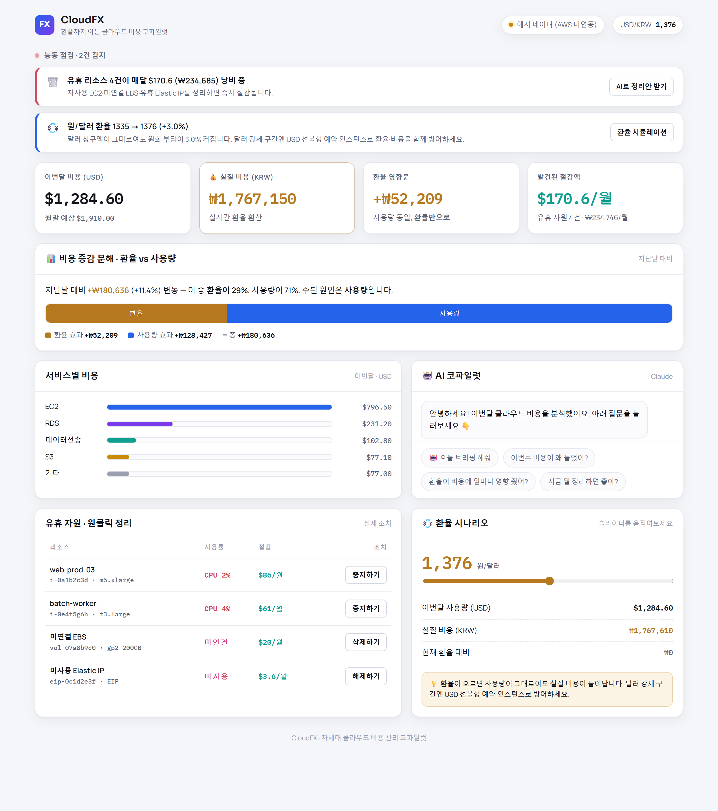
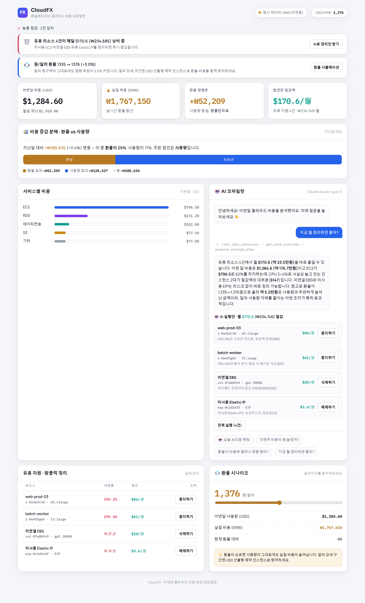
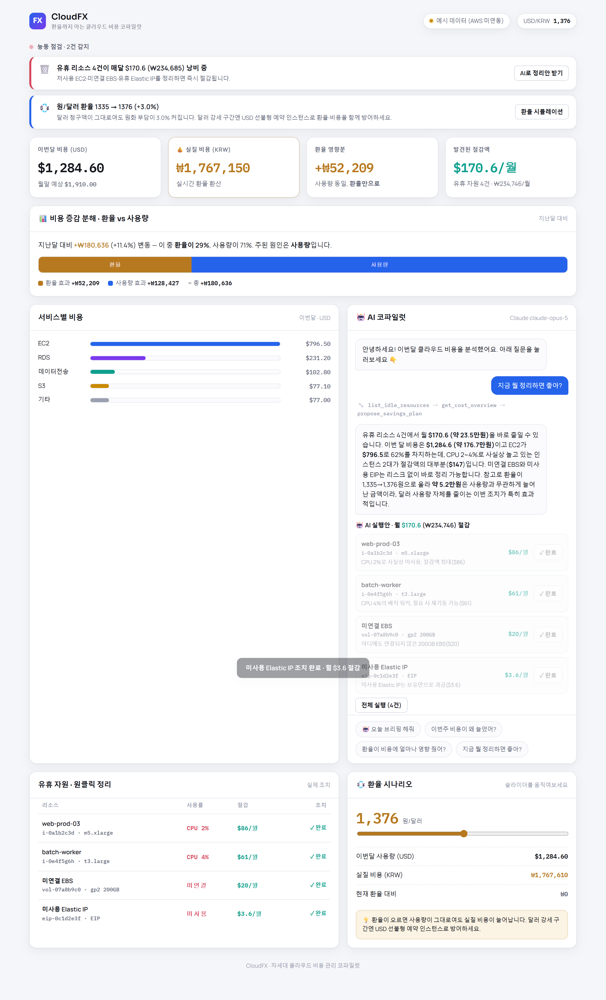
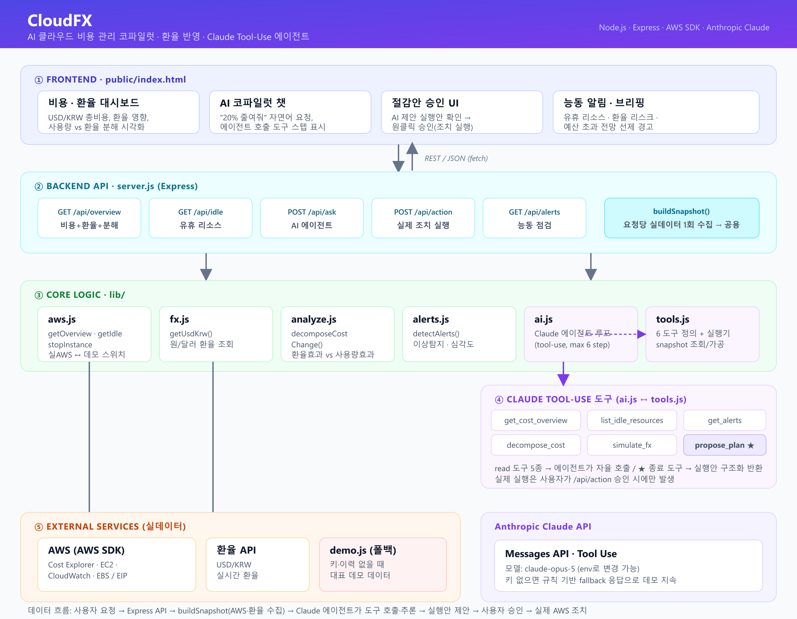

# CloudFX — 환율까지 아는 AI 클라우드 비용 관리 코파일럿

글로벌 FinOps 툴은 달러권 대기업용이라 **환율을 모른다**. CloudFX는 환율에 시달리는
아시아 무역·커머스 기업을 위한, **환율을 아는 AI 클라우드 비용 관리 시스템**입니다.
클라우드 요금은 USD로 청구되므로, 사용량이 그대로여도 **환율만으로 실질 비용이 출렁입니다.**

## 🖥 데모

> 아래 화면은 **예시(가상) 데이터 모드**로 실행한 모습입니다. AWS 자격증명 없이도 전체 흐름이 그대로 동작합니다.

**① 비용·환율 대시보드** — USD/원화 실질 비용, 환율 영향분, 사용량 vs 환율 분해, 유휴 자원, 능동 알림을 한눈에

<p align="center">
  
</p>

**② AI 코파일럿 — 절감안 제안 (Claude Tool Use)** — "지금 뭘 정리하면 좋아?" 한마디에 Claude가 스스로 도구(`list_idle_resources → get_cost_overview → propose_savings_plan`)를 호출해 근거와 함께 실행안을 제시

<p align="center">
  
</p>

**③ 승인 → 실제 조치 실행** — 사용자가 승인하면 EC2 중지·EBS 삭제·EIP 해제가 실행되고 절감액이 반영됩니다

<p align="center">
  
</p>

## 핵심 기능

- 🤖 **AI 에이전트 (Claude tool-use)** — "20% 줄여줘"라고 하면 Claude가 **스스로 도구를 호출**해
  비용·유휴 자원을 조사하고, 실행 가능한 **절감안**을 만들어 제안합니다. (실제 실행은 사용자가 승인)
- 🔻 **유휴 자원 원클릭 정리 (실제 조치)** — 저사용 EC2 **중지**, 미연결 EBS **삭제**, 유휴 Elastic IP **해제**를
  실제 AWS 계정에서 탐지하고, 버튼 한 번으로 실행합니다.
- 📊 **환율 vs 사용량 분해** — 비용이 오르면 그게 **환율 탓인지, 실제 사용량 증가 탓인지**를 정확히 쪼개어 보여줍니다.
- 🚨 **능동 이상탐지·알림** — 사용자가 묻기 전에 시스템이 먼저 유휴 낭비·환율 리스크·예산 초과 전망·비용 급증을 감지합니다.
- 💰 **원화/엔화 실질 환산** + 실시간 환율, **환율 시나리오 시뮬레이터**.

## 데이터 모드 (실데이터 ↔ 하이브리드 ↔ 예시)

| 상황 | 동작 |
|---|---|
| AWS 키 없음 | 예시 데이터로 전체 기능 시연 (AI는 규칙 기반 폴백) |
| AWS 연동 + 실지출 있음 | 100% 실데이터 |
| AWS 연동 + 실지출 ≈ $0 (신규 계정) | **유휴 자원·조치·알림은 실제**, 비용·환율 분석만 대표 데이터로 표시 → **실지출이 쌓이면 자동으로 실데이터 전환** |

## 빠른 시작

```bash
npm install
npm start          # 개발 중 자동 재시작: npm run dev
```

→ http://localhost:3000

**자격증명이 하나도 없어도 예시 데이터로 바로 실행됩니다.** 실데이터로 전환하려면:

```bash
cp .env.example .env   # Windows: copy .env.example .env
```

`.env`에 값을 채우면 자동 전환됩니다:
- `ANTHROPIC_API_KEY` → AI 에이전트가 실제 Claude로 동작 (없으면 규칙 기반 폴백)
- `AWS_ACCESS_KEY_ID` / `AWS_SECRET_ACCESS_KEY` → 실제 AWS 비용/자원 연동
  (또는 `~/.aws/credentials` 사용 시 `USE_AWS=true`)
- `MONTHLY_BUDGET_USD` (선택) → 월말 예산 초과 알림 기준

## AWS IAM 최소 권한

```
ce:GetCostAndUsage, ce:GetCostForecast
ec2:DescribeInstances, ec2:DescribeVolumes, ec2:DescribeAddresses
cloudwatch:GetMetricStatistics
ec2:StopInstances          ← 조치(쓰기)는 이것만
```

⚠️ 데모에서는 **stop(중지)만 실제 실행**됩니다. 되돌릴 수 있어 안전합니다.

## 아키텍처

<p align="center">
  
</p>

요청이 들어오면 Express가 `buildSnapshot()`으로 **AWS·환율 데이터를 요청당 1회 수집**하고,
Claude 에이전트가 그 스냅샷 위에서 도구를 호출·추론해 **절감안**을 만들며, 사용자가 승인할 때만 실제 AWS 조치가 실행됩니다.

```
server.js          Express API: /api/overview, /api/idle, /api/action, /api/ask, /api/alerts
lib/aws.js         AWS 비용조회·유휴탐지(EC2/EBS/EIP)·중지 (실데이터↔예시 자동전환·하이브리드)
lib/fx.js          실시간 USD/KRW 환율
lib/ai.js          Claude tool-use 에이전트 (폴백 포함)
lib/tools.js       에이전트 도구: 비용조회·유휴자원·환율시뮬·분해·알림·실행안 제안
lib/analyze.js     환율효과/사용량효과 비용 증감 분해
lib/alerts.js      능동 이상탐지 규칙 (유휴 낭비·환율 리스크·예산·급증)
lib/demo.js        예시 데이터
public/index.html  대시보드 (능동 알림 · KPI · 분해 카드 · AI 챗 · 유휴 정리 · 환율 시뮬)
```

## 기술 스택

Node.js · Express · AWS SDK(Cost Explorer / EC2 / CloudWatch) · Anthropic Claude(tool-use) · Claude Code로 개발

## 로드맵

- [x] 실제 AWS 계정 연동 검증 (비용·자원)
- [x] AI 에이전트화 (Claude tool-use) + 원클릭 실행안
- [x] 환율 vs 사용량 비용 분해
- [x] 능동 이상탐지·알림
- [x] 실데이터↔대표데이터 하이브리드 (실지출 발생 시 자동 전환)
- [ ] 엔화(JPY) 지원
- [ ] 예측에 환율 시나리오 결합
- [ ] 조치 종류 확대 (EBS 삭제·EIP 해제 실제 실행, gp2→gp3)
